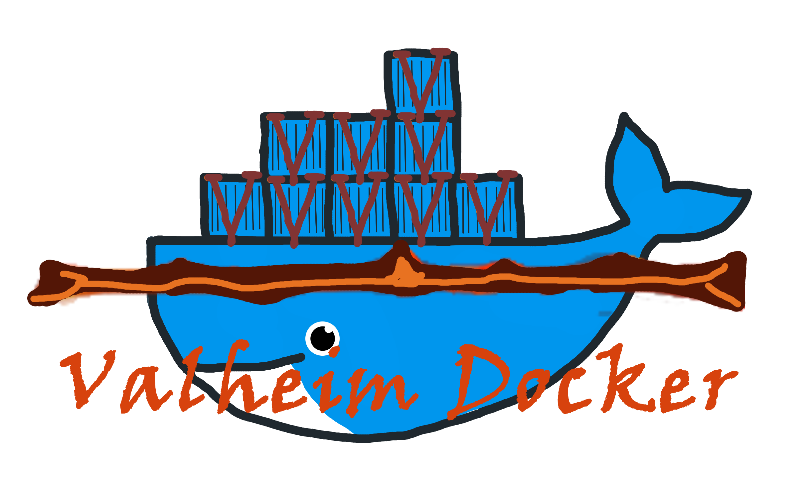

# [Valheim]
<a href="https://hub.docker.com/r/mbround18/valheim">
    
</a>

<a href="https://github.com/mbround18/valheim-docker/actions/workflows/docker-publish.yml">
    
</a>

<a href="https://github.com/mbround18/valheim-docker/actions/workflows/rust.yml">
    
</a>


## Docker

> [If you are looking for a guide on how to get started click here](https://github.com/mbround18/valheim-docker/discussions/28)
> 
> Mod Support! It is supported to launch the server with BepInEx but!!!!! as a disclaimer! You take responsibility for debugging why your server won't start.
> Modding is not supported by the Valheim developers officially yet; Which means you WILL run into errors. This repo has been tested with running ValheimPlus as a test mod and does not have any issues.
> See [Getting started with mods]

### Environment Variables

> See further on down for advanced environment variables. 

| Variable                 | Default                | Required | Description |
|--------------------------|------------------------|----------|-------------|
| TZ                       | `America/Los_Angeles`  | FALSE    | Sets what timezone your container is running on. This is used for timestamps and cron jobs. [Click Here for which timezones are valid.](https://en.wikipedia.org/wiki/List_of_tz_database_time_zones) |
| PUID                     | `1000`                 | FALSE    | Sets the User Id of the steam user. |
| PGID                     | `1000`                 | FALSE    | Sets the Group Id of the steam user. |
| PORT                     | `2456`                 | TRUE     | Sets the port your server will listen on. Take note it will also listen on +2 (ex: 2456, 2457, 2458) |
| NAME                     | `Valheim Docker`       | TRUE     | The name of your server! Make it fun and unique! |
| WORLD                    | `Dedicated`            | TRUE     | This is used to generate the name of your world. |
| PUBLIC                   | `1`                    | FALSE    | Sets whether or not your server is public on the server list. |
| PASSWORD                 | `12345`                | TRUE     | Set this to something unique! |
| AUTO_UPDATE              | `0`                    | FALSE    | Set to `1` if you want your container to auto update! This means at 1 am it will update, stop, and then restart your server. |
| AUTO_UPDATE_SCHEDULE     | `0 1 * * *`            | FALSE    | This works in conjunction with `AUTO_UPDATE` and sets the schedule to which it will run an auto update. [If you need help figuring out a cron schedule click here]
| AUTO_BACKUP              | `0`                    | FALSE    | Set to `1` to enable auto backups. Backups are stored under `/home/steam/backups` which means you will have to add a volume mount for this directory. |
| AUTO_BACKUP_SCHEDULE     | `*/15 * * * *`         | FALSE    | Change to set how frequently you would like the server to backup. [If you need help figuring out a cron schedule click here].
| AUTO_BACKUP_REMOVE_OLD   | `1`                    | FALSE    | Set to `0` to keep all backups or manually manage them. |
| AUTO_BACKUP_DAYS_TO_LIVE | `3`                    | FALSE    | This is the number of days you would like to keep backups for. While backups are compressed and generally small it is best to change this number as needed. |
| AUTO_BACKUP_ON_UPDATE    | `0`                    | FALSE    | Create a backup on right before updating and starting your server. |
| AUTO_BACKUP_ON_SHUTDOWN  | `0`                    | FALSE    | Create a backup on shutdown. |
| WEBHOOK_URL              | ``                     | FALSE    | Supply this to get information regarding your server's status in a webhook or Discord notification! [Click here to learn how to get a webhook url for Discord](https://help.dashe.io/en/articles/2521940-how-to-create-a-discord-webhook-url) | 
| UPDATE_ON_STARTUP        | `1`                    | FALSE    | Tries to update the server the container is started. |

### Docker Compose

#### Simple

> This is a basic example of a docker compose, you can apply any of the variables above to the `environment` section below but be sure to follow each variables description notes!

```yaml
version: "3"
services:
  valheim:
    image: mbround18/valheim:latest
    ports:
      - 2456:2456/udp
      - 2457:2457/udp
      - 2458:2458/udp
    environment:
      - PORT=2456
      - NAME="Created With Valheim Docker"
      - WORLD="Dedicated"
      - PASSWORD="Banana Phone"
      - TZ=America/Chicago
      - PUBLIC=1
    volumes:
    - ./valheim/saves:/home/steam/.config/unity3d/IronGate/Valheim
    - ./valheim/server:/home/steam/valheim
```

#### Everything but the kitchen sink

```yaml
version: "3"
services:
  valheim:
    image: mbround18/valheim:latest
    ports:
      - 2456:2456/udp
      - 2457:2457/udp
      - 2458:2458/udp
    environment:
      - PORT=2456
      - NAME="Created With Valheim Docker"
      - WORLD="Dedicated"
      - PASSWORD="Strong! Password @ Here"
      - TZ=America/Chicago
      - PUBLIC=1
      - AUTO_UPDATE=1
      - AUTO_UPDATE_SCHEDULE="0 1 * * *"
      - AUTO_BACKUP=1
      - AUTO_BACKUP_SCHEDULE="*/15 * * * *"
      - AUTO_BACKUP_REMOVE_OLD=1
      - AUTO_BACKUP_DAYS_TO_LIVE=3
      - AUTO_BACKUP_ON_UPDATE=1
      - AUTO_BACKUP_ON_SHUTDOWN=1
      - WEBHOOK_URL="https://discord.com/api/webhooks/IM_A_SNOWFLAKE/AND_I_AM_A_SECRET"
      - UPDATE_ON_STARTUP=0
    volumes:
      - ./valheim/saves:/home/steam/.config/unity3d/IronGate/Valheim
      - ./valheim/server:/home/steam/valheim
      - ./valheim/backups:/home/steam/backups
```

### [Odin]

This repo has a CLI tool called [Odin] in it! It is used for managing the server inside the container. If you are looking for instructions for it click here: [Odin]

[Click here to see advanced environment variables for Odin](./docs/odin.md)

### [BepInEx Support](./docs/bepinex.md)

This repo automatically launches with the proper environment variables for BepInEx. 
However, you have to install it manually in the container due to the fact that the modding community around Valheim is still in its infancy.

[Click Here to view documentation on BepInEx Support](./docs/bepinex.md)


### [Webhook Support](./docs/webhooks.md)

This repo can automatically send notifications to discord via the WEBHOOK_URL variable. 
Only use the documentation link below if you want advanced settings!

[Click Here to view documentation on Webhook Support](./docs/webhooks.md)


## Sponsors

<a href="https://github.com/AtroposOrbis">
  
</a>
<a href="https://github.com/AtroposOrbis"></a>

## Release Notifications

If you would like to have release notifications tied into your Discord server, click here: 

<a href="https://discord.gg/3kTNUZz276">
  
</a>

**Note**: The discord is PURELY for release notifications and any + all permissions involving sending chat messages has been disabled. 
[Any support for this repository must take place on the Discussions.](https://github.com/mbround18/valheim-docker/discussions)

## Versions: 

- latest (Stable):
  - [#100] Added backup feature to run based on cronjob.
  - [#148] Added Mod support
  - Added webhook configuration and documentation updates [#158]
- 1.2.0 (Stable):
  - Readme update to include the versions section and environment variables section.
  - [#18] Changed to `root` as the default user to allow updated steams User+Group IDs.
  - [#18] Fixed issue with the timezone not persisting.
  - To exec into the container you now have to include the `-u|--user` argument to access steam directly. Example `docker-compose exec --user steam valheim bash`
  - There is now a `dry-run` command argument on `odin` to preview what the command would do. 
  - You can run with `-d|--debug` to get verbose logging of what `odin` is doing.
  - [#11] Added check for length of password and fail on odin install or odin stop failures.
  - [#24] Added public variable to dockerfile and odin
  - [#35] Fix for the server to now utilizing SIGINT `YOU WILL HAVE TO MANUALLY STOP YOUR SERVER;` use `pidof valheim_server.x86_64` to get the pid and then `kill -2 $pid` but replace pid with the pid from `pidof`
  - [#53] Formatted scripts to be more useful and added timezone scheduling.
  - [#77] Fix auto update not acknowledging variables and added odin to system bin.
  - [#89] Daemonized the server process by using rust specific bindings rather than dropping down to shell. 
- 1.1.1 (Stable): 
  - Includes PR [#10] to fix the double world argument. 
- 1.1.0 (Stable): 
  - Includes a fix for [#3] and [#8].
  - Improves the script interface and separation of concerns, files now have a respective code file that supports interactions for cleaner development experience.
  - Docker image is cleaned up to provide a better usage experience. There is now an `AUTO_UPDATE` feature.
  - Has a bug where the script has two entries for the world argument.
- 1.0.0 (Stable):
  - It works! It will start your server and stop when you shut down. 
  - This supports passing in environment variables or arguments to `odin`
  - Has a bug in which it does not read passed in variables appropriately to Odin. Env variables are not impacted see [#3]. 

[//]: <> (Github Issues below...........)
[#158]: https://github.com/mbround18/valheim-docker/pull/158
[#148]: https://github.com/mbround18/valheim-docker/pull/148
[#100]: https://github.com/mbround18/valheim-docker/pull/100
[#89]: https://github.com/mbround18/valheim-docker/pull/89
[#77]: https://github.com/mbround18/valheim-docker/pull/77
[#53]: https://github.com/mbround18/valheim-docker/pull/53
[#35]: https://github.com/mbround18/valheim-docker/issues/24
[#24]: https://github.com/mbround18/valheim-docker/issues/24
[#18]: https://github.com/mbround18/valheim-docker/pull/18
[#11]: https://github.com/mbround18/valheim-docker/issues/11
[#10]: https://github.com/mbround18/valheim-docker/pull/10
[#8]: https://github.com/mbround18/valheim-docker/issues/8
[#3]: https://github.com/mbround18/valheim-docker/issues/3 


[//]: <> (Links below...................)
[Odin]: ./docs/odin.md
[Valheim]: https://www.valheimgame.com/
[Getting started with mods]: ./docs/getting_started_with_mods.md
[If you need help figuring out a cron schedule click here]: https://crontab.guru/#0_1_*_*_*

[//]: <> (Image Base Url: https://github.com/mbround18/valheim-docker/blob/main/docs/assets/name.png?raw=true)
