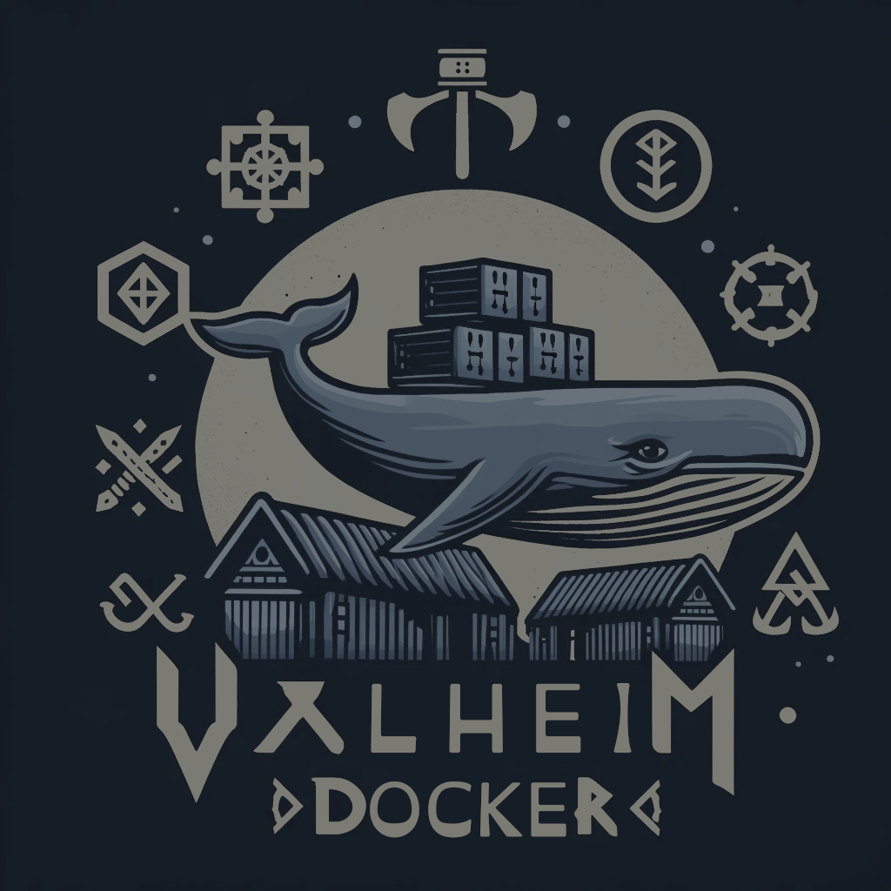

# [Valheim]


<br>
<!-- Docker Pulls -->
<a href="https://hub.docker.com/r/mbround18/valheim">
  
</a>

<!-- Docker Release Workflow -->
<a href="https://github.com/mbround18/valheim-docker/actions/workflows/docker-release.yml">
  
</a>

<!-- ALL-CONTRIBUTORS-BADGE:START - Do not remove or modify this section -->

[](#contributors-)

<!-- ALL-CONTRIBUTORS-BADGE:END -->

## Table of Contents

- [Valheim](#valheim)
  - [Running on a Bare-Metal Linux Server](#running-on-a-bare-metal-linux-server)
    - [From Release](#from-release)
    - [From Source](#from-source)
  - [Running with Docker](#running-with-docker)
    - [Download Locations](#download-locations)
      - [DockerHub](#dockerhub)
      - [GitHub Container Registry](#github-container-registry)
    - [Environment Variables](#environment-variables)
      - [Container Env Variables](#container-env-variables)
      - [Auto Update](#auto-update)
      - [Auto Backup](#auto-backup)
      - [Scheduled Restarts](#scheduled-restarts)
  - [Docker Compose](#docker-compose)
    - [Simple](#simple)
    - [Everything but the Kitchen Sink](#everything-but-the-kitchen-sink)
  - [Bundled Tools](#bundled-tools)
    - [Odin](#odin)
    - [Huginn HTTP Server](#huginn-http-server)
  - [Feature Information](#feature-information)
    - [BepInEx Support](#bepinex-support)
    - [Webhook Support](#webhook-support)
  - [Guides](#guides)
    - [How to Transfer Files](#how-to-transfer-files)
  - [Additional Information](#additional-information)
    - [Discord Release Notifications](#discord-release-notifications)
    - [Versions](#versions)
  - [Sponsors](#sponsors)
  - [Contributors ✨](#contributors-)
    - [External Guides](#external-guides)

## Running on a Bare-Metal Linux Server

### From Release

1. Navigate to [the latest release](https://github.com/mbround18/valheim-docker/releases/latest)
2. Download the `bundle.zip` to your server
3. Extract the `bundle.zip`
4. Make the files executable `chmod +x {odin,huginn}`
5. Optional: Add the files to your PATH.
6. Navigate to the folder where you want your server installed.
7. Run `odin configure --password "Your Super Strong Password"` (you can also supply `--name "Server Name"`, `--port "Server Port"`, or other arguments available).
8. Finally, run `odin start`.

**More in-depth How-to Article:** [Running Valheim on a Linux Server](https://dev.to/mbround18/running-valheim-on-an-linux-server-4kh1)

### From Source

This repo bundles its tools in a way that you can run them without having to install Docker!
If you purely want to run this on a Linux-based system, without Docker, take a look at the links below:

- [Installing & Using Odin](./src/odin/README.md): Odin runs the show and does almost all the heavy lifting in this repo. It starts, stops, and manages your Valheim server instance.
- [Installing & Using Huginn](./src/huginn/README.md): Huginn is an HTTP server built on the same source as Odin and uses these capabilities to expose a few HTTP endpoints.

> Using the binaries to run on an Ubuntu Server, you will have to be more involved and configure a few things manually.
> If you want a managed, easy one-two punch to manage your server, then look at the Docker section.

## Running with Docker

### Mods Quick Start

Want to run Valheim with mods? Here's the shortest path:

- Set `TYPE=BepInEx` (installs the BepInEx framework automatically)
- Provide mods via `MODS` as a newline-separated list of dependency strings or direct URLs

Example (compose):

```yaml
services:
  valheim:
    image: mbround18/valheim:3
    environment:
      - TYPE=BepInEx
      - |
        MODS=ValheimModding-Jotunn-*
        OdinPlus-OdinHorse-1.4.12
        https://cdn.thunderstore.io/live/repository/packages/abearcodes-SimpleRecycling-0.0.10.zip
```

Notes:

- Wildcards are supported and resolve to the latest version at startup:
  - `Author-Package-*` (latest)
  - `Author-Package-1.*` (latest matching major)
  - `Author-Package-1.2.*` (latest matching major/minor)
- Prefer pinning exact versions for stability in production
- With many mods, consider disabling automatic updates to avoid mismatch issues

See the full guide: docs/tutorials/getting_started_with_mods.md

> This image uses version 3+ for all of its compose examples.
> Please use Docker engine >=20 or make adjustments accordingly.
> For production, pin to a major/minor tag (for example `:3`) and avoid `:latest`.
>
> [Guide to get started](https://github.com/mbround18/valheim-docker/discussions/28)
>
> Mod Support! It is supported to launch the server with BepInEx, but as a disclaimer, you take responsibility for debugging why your server won't start. Modding is not supported by the Valheim developers officially yet, which means you WILL run into errors.
> See [Getting started with mods](./docs/tutorials/getting_started_with_mods.md)

### Download Locations

#### DockerHub

<a href="https://hub.docker.com/r/mbround18/valheim">
  
</a>
<a href="https://hub.docker.com/r/mbround18/valheim-odin">
  
</a>

#### GitHub Container Registry

<a href="https://github.com/users/mbround18/packages/container/package/valheim">
  
</a>
<a href="https://github.com/users/mbround18/packages/container/package/valheim-odin">
  
</a>

### Environment Variables

> See further down for advanced environment variables.

| Variable                       | Default                                | Required | Description                                                                                                                                                                                                                                                                                                                       |
| ------------------------------ | -------------------------------------- | -------- | --------------------------------------------------------------------------------------------------------------------------------------------------------------------------------------------------------------------------------------------------------------------------------------------------------------------------------- |
| PORT                           | `2456`                                 | TRUE     | Sets the port your server will listen on. Take note it will also listen on +2 (e.g., 2456, 2457, 2458)                                                                                                                                                                                                                            |
| APPID                          | `896660`                               | FALSE    | Steam App ID exported for server startup compatibility. Override only if you know exactly why you need to.                                                                                                                                                                                                                        |
| NAME                           | `Valheim Docker`                       | TRUE     | The name of your server! Make it fun and unique!                                                                                                                                                                                                                                                                                  |
| WORLD                          | `Dedicated`                            | TRUE     | This is used to generate the name of your world.                                                                                                                                                                                                                                                                                  |
| PUBLIC                         | `1`                                    | FALSE    | Sets whether or not your server is public on the server list.                                                                                                                                                                                                                                                                     |
| PASSWORD                       | `<please set me>`                      | TRUE     | Set this to something unique!                                                                                                                                                                                                                                                                                                     |
| ENABLE_CROSSPLAY               | `0`                                    | FALSE    | Enable crossplay support as of `Valheim Version >0.211.8`                                                                                                                                                                                                                                                                         |
| TYPE                           | `Vanilla`                              | FALSE    | This can be set to `BepInEx` or `Vanilla`                                                                                                                                                                                                                                                                                         |
| PRESET                         | ``                                     | FALSE    | Normal, Casual, Easy, Hard, Hardcore, Immersive, Hammer                                                                                                                                                                                                                                                                           |
| MODIFIERS                      | ``                                     | FALSE    | Comma-separated array of modifiers. EX: `combat=easy,raids=muchmore`                                                                                                                                                                                                                                                              |
| SET_KEY                        | ``                                     | FALSE    | Can be any of the following: nobuildcost, playerevents, passivemobs, nomap                                                                                                                                                                                                                                                        |
| MODS                           | `<nothing>`                            | FALSE    | This is an array of mods separated by comma and a new line. [Examples](./docs/tutorials/getting_started_with_mods.md). Supported files are `zip`, `dll`, and `cfg`.                                                                                                                                                               |
| WEBHOOK_URL                    | `<nothing>`                            | FALSE    | Supply this to get information regarding your server's status in a webhook or Discord notification! [How to create a Discord webhook URL](https://help.dashe.io/en/articles/2521940-how-to-create-a-discord-webhook-url)                                                                                                          |
| WEBHOOK_INCLUDE_PUBLIC_IP      | `0`                                    | FALSE    | Optionally include your server's public IP in webhook notifications, useful if not using a static IP address. NOTE: If your server is behind a NAT using PAT with more than one external IP address (very unlikely on a home network), this could be inaccurate if your NAT doesn't maintain your server to a single external IP. |
| PLAYER_EVENT_NOTIFICATIONS     | `0`                                    | FALSE    | Optional, if you have a webhook url supplied and turn this to one. It will post when a player joins/leaves the server.                                                                                                                                                                                                            |
| UPDATE_ON_STARTUP              | `1`                                    | FALSE    | Tries to update the server the container is started.                                                                                                                                                                                                                                                                              |
| ADDITIONAL_STEAMCMD_ARGS       | ``                                     | FALSE    | Sets optional arguments for install                                                                                                                                                                                                                                                                                               |
| STEAMCMD_RETRY_ATTEMPTS        | `3`                                    | FALSE    | Number of retry attempts for SteamCMD commands (install/app_info).                                                                                                                                                                                                                                                                |
| STEAMCMD_RETRY_BASE_DELAY_SECS | `5`                                    | FALSE    | Base delay in seconds for exponential backoff between SteamCMD retries.                                                                                                                                                                                                                                                           |
| BETA_BRANCH                    | `public-test`                          | FALSE    | Sets the beta branch for the server.                                                                                                                                                                                                                                                                                              |
| BETA_BRANCH_PASSWORD           | `yesimadebackups`                      | FALSE    | Sets the password for the beta branch.                                                                                                                                                                                                                                                                                            |
| USE_PUBLIC_BETA                | `0`                                    | FALSE    | Set to `1` to enable the configured beta branch for install/update flows.                                                                                                                                                                                                                                                         |
| VALIDATE_ON_INSTALL            | `1`                                    | FALSE    | Set to `0` to skip SteamCMD `validate` during install/update.                                                                                                                                                                                                                                                                     |
| CLEAN_INSTALL                  | `0`                                    | FALSE    | Set to `1` to clear install contents before install (ignored for live dir when `STAGED_UPDATES=1`).                                                                                                                                                                                                                               |
| CLEAR_STEAM_CACHE_ON_INSTALL   | `1`                                    | FALSE    | Set to `0` to skip pre-install Steam cache cleanup.                                                                                                                                                                                                                                                                               |
| SERVER_EXTRA_LAUNCH_ARGS       | ``                                     | FALSE    | Additional launch args appended to the Valheim server command.                                                                                                                                                                                                                                                                    |
| ADDITIONAL_SERVER_ARGS         | ``                                     | FALSE    | Legacy/compat additional launch args appended after `SERVER_EXTRA_LAUNCH_ARGS`.                                                                                                                                                                                                                                                   |
| STAGED_UPDATES                 | `0`                                    | FALSE    | Set to `1` to install updates into a staging directory first and only promote to live after validation.                                                                                                                                                                                                                           |
| STAGED_INSTALL_DIR             | `/home/steam/.staging/valheim-pending` | FALSE    | Override the staging installation directory used when `STAGED_UPDATES=1`.                                                                                                                                                                                                                                                         |

#### Container Env Variables

| Variable | Default               | Required | Description                                                                                                                                                                                                |
| -------- | --------------------- | -------- | ---------------------------------------------------------------------------------------------------------------------------------------------------------------------------------------------------------- |
| TZ       | `America/Los_Angeles` | FALSE    | Sets what timezone your container is running on. This is used for timestamps and scheduled jobs. [Click Here for which timezones are valid.](https://en.wikipedia.org/wiki/List_of_tz_database_time_zones) |

#### Auto Update

| Variable                       | Default     | Required | Description                                                                                                                                                                                                                                                                     |
| ------------------------------ | ----------- | -------- | ------------------------------------------------------------------------------------------------------------------------------------------------------------------------------------------------------------------------------------------------------------------------------- |
| AUTO_UPDATE                    | `0`         | FALSE    | Set to `1` if you want your container to auto update! This means at the times indicated by `AUTO_UPDATE_SCHEDULE` it will check for server updates. If there is an update then the server will be shut down, updated, and brought back online if the server was running before. |
| AUTO_UPDATE_SCHEDULE           | `0 1 * * *` | FALSE    | This works in conjunction with `AUTO_UPDATE` and sets the schedule to which it will run an auto update via Odin's built-in scheduler. [If you need help figuring out a cron expression click here](https://crontab.guru/#0_1____)                                               |
| AUTO_UPDATE_PAUSE_WITH_PLAYERS | `0`         | FALSE    | Does not process an update for the server if there are players online.                                                                                                                                                                                                          |

#### Auto Backup

| Variable                          | Default        | Required | Description                                                                                                                                                                                  |
| --------------------------------- | -------------- | -------- | -------------------------------------------------------------------------------------------------------------------------------------------------------------------------------------------- |
| AUTO_BACKUP                       | `0`            | FALSE    | Set to `1` to enable auto backups. Backups are stored under `/home/steam/backups` which means you will have to add a volume mount for this directory.                                        |
| AUTO_BACKUP_SCHEDULE              | `*/15 * * * *` | FALSE    | Change to set how frequently you would like the server to backup via Odin's built-in scheduler. [If you need help figuring out a cron expression click here](https://crontab.guru/#0_1____). |
| AUTO_BACKUP_NICE_LEVEL            | `NOT SET`      | FALSE    | [Do NOT set this variable unless you are following this guide here](https://github.com/mbround18/valheim-docker/discussions/532)                                                             |
| AUTO_BACKUP_REMOVE_OLD            | `1`            | FALSE    | Set to `0` to keep all backups or manually manage them.                                                                                                                                      |
| AUTO_BACKUP_DAYS_TO_LIVE          | `3`            | FALSE    | This is the number of days you would like to keep backups for. While backups are compressed and generally small it is best to change this nu                                                 |
| AUTO_BACKUP_ON_UPDATE             | `0`            | FALSE    | Create a backup on right before updating and starting your server.                                                                                                                           |
| AUTO_BACKUP_ON_SHUTDOWN           | `0`            | FALSE    | Create a backup on shutdown.                                                                                                                                                                 |
| AUTO_BACKUP_PAUSE_WITH_NO_PLAYERS | `0`            | FALSE    | Will skip creating a backup if there are no players. `PUBLIC` must be set to `1` for this to work!                                                                                           |

#### Scheduled Restarts

Scheduled restarts allow the operator to trigger restarts using Odin's built-in scheduler

| Variable                   | Default     | Required | Description                                                                     |
| -------------------------- | ----------- | -------- | ------------------------------------------------------------------------------- |
| SCHEDULED_RESTART          | `0`         | FALSE    | Allows you to enable scheduled restarts                                         |
| SCHEDULED_RESTART_SCHEDULE | `0 2 * * *` | FALSE    | Defaults to everyday at 2 am but can be configured with a valid cron expression |

#### Scheduler State

`odin jobs` persists runtime state at `ODIN_SCHEDULER_STATE_FILE` if set, otherwise `${GAME_LOCATION}/logs/jobs_state.json`.
This state is included in `odin status --json` and Huginn `/status` as `scheduler_state`.

#### Migration Note (Cron Removed)

System cron is no longer used inside the container.
If you previously relied on container cron files, keep using the same `AUTO_*_SCHEDULE` and `SCHEDULED_RESTART_SCHEDULE` variables; they now run through Odin's built-in scheduler.

### Notes on Rootless Design

This Docker image is designed to run as a rootless container by default, using the user `111:1000`. If you need to run the container as a specific user, you can set the `--user` flag in the Docker CLI or configure the `user` field in your Docker Compose file.

#### Example Docker CLI Usage

```bash
docker run --user 1001:1001 mbround18/valheim:3
```

#### Example Docker Compose Configuration

```yaml
version: "3"
services:
  valheim:
    image: mbround18/valheim:3
    user: "1001:1001"
    ...
```

### Removed PUID and GUID

References to `PUID` and `GUID` have been removed. Use the `--user` flag or `user` field as shown above to specify a user. If you, are migrating on the host you will have to stop the container when upgrading and check the folder permissions. Changing them to 1000:1000 before relaunching.

## Docker Compose

> This image uses version 3+ for all of its compose examples.
> Please use Docker engine >=20 or make adjustments accordingly.

### Simple

> This is a basic example of a Docker Compose file. You can apply any of the variables above to the `environment` section below but be sure to follow each variable's description notes!

```yaml
version: "3"
services:
  valheim:
    image: mbround18/valheim:3
    stop_signal: SIGINT
    ports:
      - "2456:2456/udp"
      - "2457:2457/udp"
      - "2458:2458/udp"
    environment:
      PORT: 2456
      NAME: "Created With Valheim Docker"
      WORLD: "Dedicated"
      PASSWORD: "Banana Phone"
      TZ: "America/Chicago"
      PUBLIC: 1
    volumes:
      - ./valheim/saves:/home/steam/.config/unity3d/IronGate/Valheim
      - ./valheim/server:/home/steam/valheim
```

### Everything but the Kitchen Sink

```yaml
version: "3"
services:
  valheim:
    image: mbround18/valheim:3
    stop_signal: SIGINT
    ports:
      - "2456:2456/udp"
      - "2457:2457/udp"
      - "2458:2458/udp"
    environment:
      PORT: 2456
      NAME: "Created With Valheim Docker"
      WORLD: "Dedicated"
      PASSWORD: "Strong! Password @ Here"
      TZ: "America/Chicago"
      PUBLIC: 1
      AUTO_UPDATE: 1
      AUTO_UPDATE_SCHEDULE: "0 1 * * *"
      AUTO_BACKUP: 1
      AUTO_BACKUP_SCHEDULE: "*/15 * * * *"
      AUTO_BACKUP_REMOVE_OLD: 1
      AUTO_BACKUP_DAYS_TO_LIVE: 3
      AUTO_BACKUP_ON_UPDATE: 1
      AUTO_BACKUP_ON_SHUTDOWN: 1
      WEBHOOK_URL: "https://discord.com/api/webhooks/IM_A_SNOWFLAKE/AND_I_AM_A_SECRET"
      WEBHOOK_INCLUDE_PUBLIC_IP: 1
      UPDATE_ON_STARTUP: 0
    volumes:
      - ./valheim/saves:/home/steam/.config/unity3d/IronGate/Valheim
      - ./valheim/server:/home/steam/valheim
      - ./valheim/backups:/home/steam/backups
```

## Bundled Tools

### [Odin]

This repo has a CLI tool called [Odin] in it! It is used for managing the server inside the container. If you are looking for instructions for it, click here: [Odin]

[Click here to see advanced environment variables for Odin](src/odin/README.md)

### [Huginn] HTTP Server

| Variable                   | Default              | Required | Description                                                                                                                                                                        |
| -------------------------- | -------------------- | -------- | ---------------------------------------------------------------------------------------------------------------------------------------------------------------------------------- |
| ADDRESS                    | `127.0.0.1:(PORT+1)` | FALSE    | Query address Huginn uses for server info. If unset, it defaults to loopback query port (`PORT+1`, usually `2457`). Set this if Huginn should query a different interface or host. |
| HTTP_PORT                  | `3000`               | FALSE    | HTTP port Huginn listens on. Huginn binds to `0.0.0.0` and logs `127.0.0.1` links for local convenience.                                                                           |
| HUGINN_INFO_CACHE_TTL_SECS | `2`                  | FALSE    | Status cache TTL in seconds for A2S-backed responses (`/status`, `/health`, `/readiness`, `/players`). Lower values increase freshness but also query load.                        |
| CONNECT_REMOTE_HOST        | `<unset>`            | FALSE    | Optional host/IP override for `/connect/remote`. If unset, Huginn falls back to `PUBLIC_ADDRESS`, then `ADDRESS`, then Odin public IP resolution.                                  |
| CONNECT_STEAM_APP_ID       | `892970`             | FALSE    | Steam app id used for connect deeplink generation (`steam://run/<APP_ID>//+connect%20HOST:PORT`).                                                                                  |

- `/metrics` provides a Prometheus-style metrics output.
- `/status` provides a more traditional status page.
- `/connect/local` redirects to `steam://run/892970//+connect%20127.0.0.1:PORT` (or returns JSON for browser CORS fetch clients).
- `/connect/remote` redirects to `steam://run/892970//+connect%20<public host>:PORT` (or returns JSON for browser CORS fetch clients).
- `/health` provides health status (200 when online, 503 when offline).
- `/readiness` provides Kubernetes-style readiness.
- `/liveness` provides Kubernetes-style liveness.
- `/mods` provides installed mod metadata.
- `/players` provides player counts and names when available.
- `/metadata` provides safe Odin/Huginn runtime metadata.
- `/openapi.json` provides API spec.
- `/docs` provides Swagger UI.

> Note on `ADDRESS`: This can be set to `127.0.0.1:<your query port>` or `<your public IP>:<your query port>` but does not have to be set. If it is set, it will prevent Odin from reaching out to AWS IP service to ask for your public IP address. Keep in mind, your query port is +1 of what you set in the `PORT` env variable for your Valheim server.
>
> Another note: Your server MUST be public (e.g., `PUBLIC=1`) for Odin+Huginn to collect and report statistics.

## Feature Information

### [BepInEx Support](./docs/bepinex.md)

As of [March 2021](./docs/bepinex.md), the TYPE variable can be used to automatically install BepInEx. For details, see [Getting started with mods](./docs/tutorials/getting_started_with_mods.md).

### [Webhook Support](./docs/webhooks.md)

This repo can automatically send notifications to Discord via the WEBHOOK_URL variable.
Only use the documentation link below if you want advanced settings!

[Click Here to view documentation on Webhook Support](./docs/webhooks.md)

## Guides

### [How to Transfer Files](./docs/tutorials/how_to_transfer_files.md)

This is a tutorial of a recommended path to transferring files. This can be done to transfer world files between hosts, transfer BepInEx configs, or even to transfer backups.

[Click Here to view the tutorial of how to transfer files.](./docs/tutorials/how_to_transfer_files.md)

### How to Access Your Container in Docker

```bash
docker exec -it $CONTAINER_NAME gosu steam bash
```

### How to Restore a backup

[Click this link to see the guide for restoring a backup](https://github.com/mbround18/valheim-docker/blob/main/docs/tutorials/how_to_transfer_files.md)

## Additional Information

### Discord Release Notifications

If you would like to have release notifications tied into your Discord server, click here:

<a href="https://discord.gg/3kTNUZz276">
  
</a>

**Note**: The Discord is PURELY for release notifications and any + all permissions involving sending chat messages have been disabled.
[Any support for this repository must take place on the Discussions.](https://github.com/mbround18/valheim-docker/discussions)

### Versions

- 3.x.x (Stable): LTS, minor fixes
- 2.x.x (Stable): Mod support and cleaned up the code base.
- 1.4.x (Stable): Webhook for Discord upgrade.
- 1.3.x (Stable): Health of codebase improvements.
- 1.2.0 (Stable): Added additional stop features and SIG for stopping.
- 1.1.1 (Stable): Patch to fix arguments.
- 1.1.0 (Unstable): Cleaned up image and made it faster.
- 1.0.0 (Stable): It works!

[//]: <> (Links below)
[Odin]: src/odin/README.md
[Huginn]: src/huginn/README.md
[Valheim]: https://www.valheimgame.com/

## External Guides

- [Hosting with Dokku? Check out this guide!](https://tkte.ch/articles/2023/03/03/Valheim.html)
- [Hosting Valheim on Rocket Pi X](https://ikarus.sg/valheim-server-rock-pi-x/)
- [Valheim on AWS](https://aws.amazon.com/getting-started/hands-on/valheim-on-aws/)
- [How to host a dedicated Valheim server on Amazon Lightsail](https://updateloop.dev/dedicated-valheim-lightsail/)
- [Experience With Valheim Game Hosting With Docker](https://norton-setup.support/games/experience-with-valheim-game-hosting-with-docker/)
- [AWS Cloudformation template using Elastic Container Service with a Spot Instance for cost savings](https://github.com/apeabody/Valheim-AWS-ECS-Spot)
