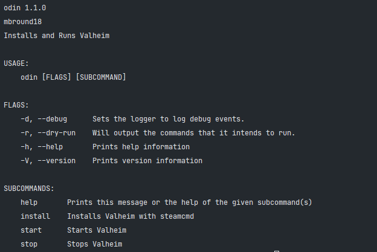
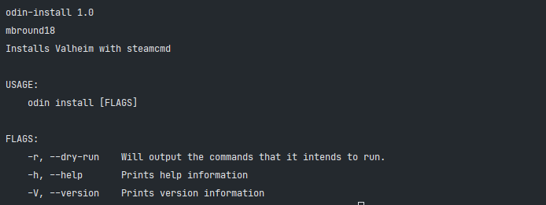
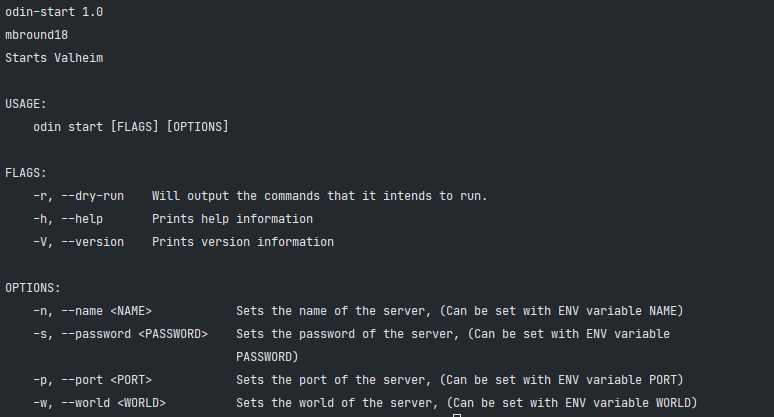
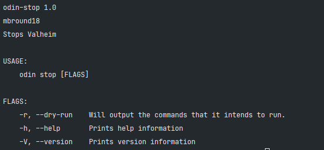

# Odin

Odin is a CLI tool utilized for installing, starting, and stopping [Valheim] servers

#### Odin Specific Environment Variables

> These are set automatically by Odin;
> you DO NOT need to set these and only mess with them if you Know what you are doing.

| Variable                 | Default                | Required | Description |
|--------------------------|------------------------|----------|-------------|
| DEBUG_MODE               | `0`                    | FALSE    | Set to `1` if you want a noisy output and to see what Odin is doing.
| ODIN_CONFIG_FILE         | `config.json`          | FALSE    | This file stores start parameters to restart the instance, change if you run multiple container instances on the same host |
| ODIN_WORKING_DIR         | `$PWD`                 | FALSE    | Sets the directory you wish to run `odin` commands in and can be used to set where valheim is managed from. |

## Gotchas

- Odin relies on Rust. [Please install Rust](https://www.rust-lang.org/tools/install)
- Odin also assumes that you have SteamCMD already installed. [Install instructions for SteamCMD.](https://developer.valvesoftware.com/wiki/SteamCMD)
- If you have the proper build tools installed you should be able to run Odin on any system.
- Current Supported Architecture: Unix & Linux based systems.

## Installation

> Make sure you have build essentials installed before you install this crate

```sh
cargo install --git https://github.com/mbround18/valheim-docker.git --branch main
```

## Usage



#### Install Valheim

```sh
odin install
```



### Start Valheim

```sh
odin start
```



### Stop Valheim

```sh
odin stop
```


