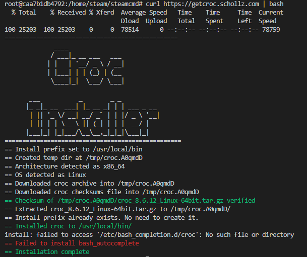

# How To Transfer Files

> This tutorial uses [schollz/croc], a CLI tool for sending files. This is useful for temporary access; if you transfer files often, consider running a [file browser](https://hub.docker.com/r/hurlenko/filebrowser) sidecar container.

## Setup

1. Access the container as root.

```sh
# This can be accomplished via many methods, but this tutorial uses Docker Compose.
docker compose exec --user root valheim bash

# 1. Replace valheim with the name of your container.
# 2. This tutorial cannot account for all the wide variety of names or methods used to create the container.
# 3. You just need to access the container via the root user to install croc.
```

1. Run `curl https://getcroc.schollz.com | bash` inside the `mbround18/valheim` container.
2. Run `curl https://getcroc.schollz.com | bash` on the destination machine. (If the destination machine is not Linux/Unix-based with access to Bash, see the [schollz/croc] repository for installation instructions.)



## Instructions

> For this example, we will be transferring world files from one instance of `mbround18/valheim` to another `mbround18/valheim`. If you have a slightly different use case, such as transferring backups, this guide will still be helpful but may not match 1:1.

1. Access the `mbround18/valheim` container A and container B as the steam user.

   ```sh
   # This can be accomplished via many methods, but this tutorial uses Docker Compose.
   docker compose exec --user steam valheim bash

   # Replace valheim with the name of your container.
   # This tutorial cannot account for all the wide variety of names or methods used to create the container.
   # You just need to access the container via the steam user when sending the files.
   ```

2. Stop the Valheim server on both machines with `odin stop`.
3. Change to your saves directory on both containers: `cd /home/steam/.config/unity3d/IronGate/Valheim`.
4. With croc already installed, run `croc send ./*` on container A.

   

5. When the transfer key is shown, copy it to container B and press Enter.

   

6. You can now safely shut down container A and restart container B.

[schollz/croc]: https://github.com/schollz/croc
