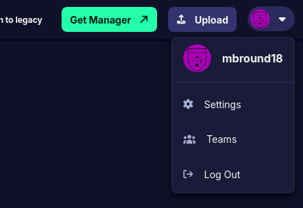
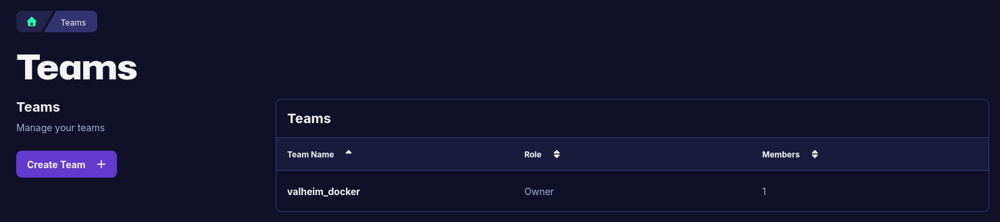
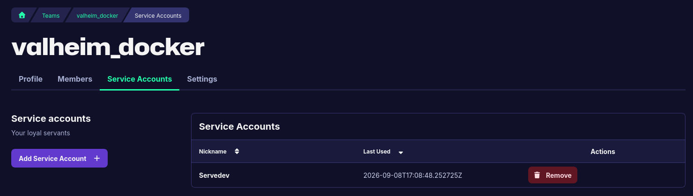
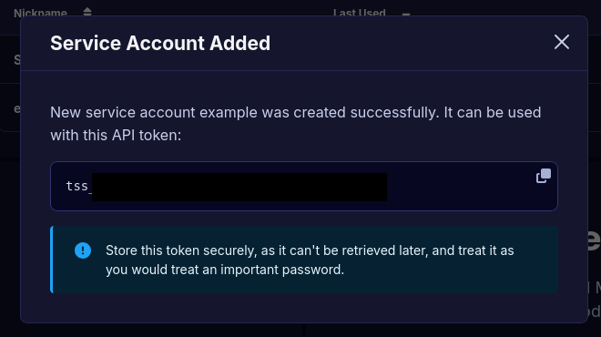

# Getting a Thunderstore API Token

`THUNDERSTORE_TOKEN` lets Odin authenticate against Thunderstore using a **service
account** API token. This guide walks through creating one.

> [!NOTE]
> **You probably do not need this.** Everything Odin reads from Thunderstore — package
> listings, wildcard version resolution, and mod downloads — is public and works with no
> credentials at all. A token does **not** raise any rate limit, so it will not fix
> `HTTP 429` errors. For those, see
> [Rate Limited Downloads](./getting_started_with_mods.md#troubleshooting-rate-limited-downloads-http-429).

## Step 1: Open your Teams

Sign in at [thunderstore.io](https://thunderstore.io), click your avatar in the top
right, and choose **Teams**.



## Step 2: Pick or create a team

Service accounts belong to a team, not to your personal user, so you need at least one.
Click an existing team, or **Create Team** if the list is empty.



## Step 3: Add a service account

Open the **Service Accounts** tab and click **Add Service Account**. Give it a nickname
that says where it will be used — something like `valheim-docker` — so you can tell
which one to revoke later.



## Step 4: Copy the token

The token is shown **once**, when the account is created. Copy it now; if you lose it you
have to delete the service account and make a new one.



Tokens start with `tss_`. Treat it like a password: it acts on behalf of your team.

## Step 5: Configure Odin

Set it as an environment variable. In `.env` (see [`.env.example`](../../.env.example)):

```sh
THUNDERSTORE_TOKEN=tss_your_token_here
```

Or in `docker-compose.yml`:

```yaml
services:
  valheim:
    environment:
      THUNDERSTORE_TOKEN: "tss_your_token_here"
```

Odin sends it as `Authorization: Bearer <token>` on requests to `thunderstore.io` and its
subdomains, including community sites and the package CDN. Requests to any other host —
GitHub release URLs, for example — never receive it.

> [!WARNING]
> Never commit a token. `.env` is gitignored for this reason. If one leaks, delete the
> service account from the **Service Accounts** tab immediately — that revokes the token.

## Verifying it works

```sh
curl -s -o /dev/null -w '%{http_code}\n' \
  -H "Authorization: Bearer $THUNDERSTORE_TOKEN" \
  https://thunderstore.io/api/experimental/current-user/
```

`200` means the token was accepted. `401` means it was rejected — check for a truncated
copy/paste or a deleted service account.

To see the identity it resolves to:

```sh
curl -s -H "Authorization: Bearer $THUNDERSTORE_TOKEN" \
  https://thunderstore.io/api/experimental/current-user/ | jq '{username, teams}'
```

An unauthenticated request to the same endpoint also returns `200`, but with a `null`
username — so check the body, not just the status code.

## A note on `THUNDERSTORE_USERNAME` / `THUNDERSTORE_PASSWORD`

These predate the token support and are **non-functional**. Thunderstore ignores HTTP
Basic auth rather than rejecting it: sending any username and password returns `200` as
an _anonymous_ user, so the pair never authenticated anything. They remain only for
backwards compatibility. Use `THUNDERSTORE_TOKEN`.

## Related

- [Getting Started with Mods](./getting_started_with_mods.md)
- [Thunderstore API documentation](https://thunderstore.io/api/docs/) (requires sign-in)
