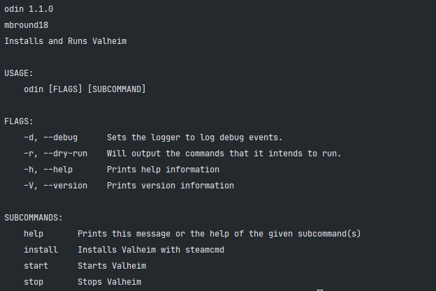
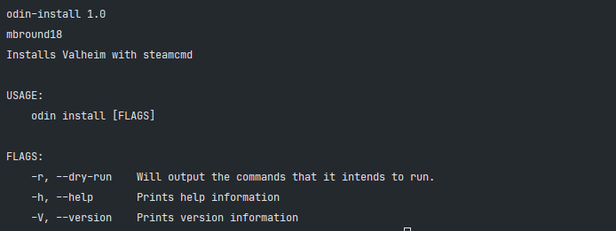
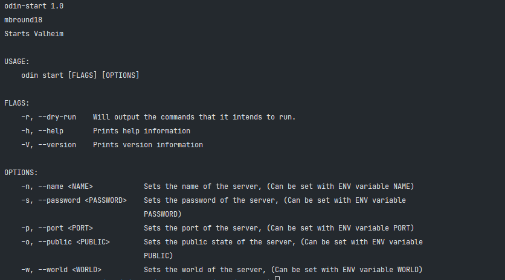
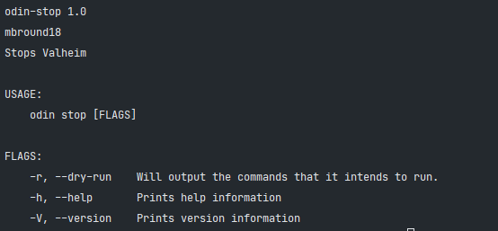

# Odin

Odin is a CLI tool for installing, starting, and stopping [Valheim] servers.

> [Who is Odin?](https://en.wikipedia.org/wiki/Odin)

## Odin Specific Environment Variables

> These are set automatically by Odin.
> You usually do not need to set them unless you are intentionally overriding advanced behavior.

| Variable                        | Default                                 | Required | Description                                                                                                                |
| ------------------------------- | --------------------------------------- | -------- | -------------------------------------------------------------------------------------------------------------------------- |
| DEBUG_MODE                      | `0`                                     | FALSE    | Set to `1` if you want a noisy output and to see what Odin is doing.                                                       |
| DRY_RUN                         | `0`                                     | FALSE    | Set to `1` to print command intent without executing mutating operations.                                                  |
| I_ACCEPT_TO_RUN_THINGS_UNSAFELY | `0`                                     | FALSE    | Root-execution acknowledgement flag for restricted/safety-sensitive paths.                                                 |
| ODIN_CONFIG_FILE                | `config.json`                           | FALSE    | This file stores start parameters to restart the instance, change if you run multiple container instances on the same host |
| ODIN_WORKING_DIR                | `$PWD`                                  | FALSE    | Sets the directory you wish to run `odin` commands in and can be used to set where valheim is managed from.                |
| SERVER_EXECUTABLE_PATH          | `./valheim_server.x86_64`               | FALSE    | Override executable path used by generated config/start flow.                                                              |
| SERVER_EXTRA_LAUNCH_ARGS        | ``                                      | FALSE    | Extra launch args appended to generated Valheim server start command.                                                      |
| ADDITIONAL_SERVER_ARGS          | ``                                      | FALSE    | Legacy/compat extra launch args appended after `SERVER_EXTRA_LAUNCH_ARGS`.                                                 |
| SAVE_INTERVAL                   | `<unset>`                               | FALSE    | Optional save interval (seconds) passed via configure flow.                                                                |
| TITLE                           | `Broadcast`                             | FALSE    | Default title used by `odin notify` when no explicit title argument is provided.                                           |
| MESSAGE                         | `Test Notification`                     | FALSE    | Default message used by `odin notify` when no explicit message argument is provided.                                       |
| USE_PUBLIC_BETA                 | `0`                                     | FALSE    | Enables beta branch behavior when combined with `BETA_BRANCH`/`BETA_BRANCH_PASSWORD`.                                      |
| VALIDATE_ON_INSTALL             | `1`                                     | FALSE    | Set to `0` to skip SteamCMD validation on install/update.                                                                  |
| CLEAN_INSTALL                   | `0`                                     | FALSE    | Set to `1` to clean install directories before installing (with staged-update behavior exceptions).                        |
| CLEAR_STEAM_CACHE_ON_INSTALL    | `1`                                     | FALSE    | Set to `0` to disable pre-install Steam cache cleanup.                                                                     |
| SHOW_FALLBACK_HANDLER           | `0`                                     | FALSE    | Set to `1` to include fallback-handler noise in `odin logs` output.                                                        |
| SHOW_SHADER_WARNINGS            | `0`                                     | FALSE    | Set to `1` to include shader warnings in `odin logs` output.                                                               |
| STEAMCMD_RETRY_ATTEMPTS         | `3`                                     | FALSE    | Number of retry attempts for SteamCMD commands (`install`, app info queries).                                              |
| STEAMCMD_RETRY_BASE_DELAY_SECS  | `5`                                     | FALSE    | Base delay in seconds used for exponential backoff between SteamCMD retries.                                               |
| STAGED_UPDATES                  | `0`                                     | FALSE    | Set to `1` to install into a staging directory first and only promote to live after validation succeeds.                   |
| STAGED_INSTALL_DIR              | `/home/steam/.staging/valheim-pending`  | FALSE    | Override the staging installation directory when `STAGED_UPDATES=1`.                                                       |
| ODIN_SCHEDULER_STATE_FILE       | `${GAME_LOCATION}/logs/jobs_state.json` | FALSE    | Override where Odin persists scheduler runtime state.                                                                      |

## Gotchas

- Odin relies on Rust. [Please install Rust](https://www.rust-lang.org/tools/install)
- Odin also assumes that you have SteamCMD already installed. [Install instructions for SteamCMD.](https://developer.valvesoftware.com/wiki/SteamCMD)
- If you have the proper build tools installed you should be able to run Odin on any system.
- Current Supported Architecture: Unix & Linux based systems.

## Setup

> Make sure you have build essentials installed before you install this crate

1. Install Rust & git
2. Clone the repo
3. `cargo install cargo-make`
4. `makers -e production release`
5. `chmod +x ./target/debug/odin`
6. Copy `./target/debug/odin` to `/usr/local/bin`

## Usage



### Install Valheim

```sh
odin install
```



### Start Valheim

```sh
odin start
```



### Stop Valheim

```sh
odin stop
```



### Status

#### Local Server

```sh
odin status
```

#### Remote Server

Replace the `xx.xx.xx.xx` with your server IP and `query-port` with the `PORT` variable +1 (ex: if `2456` use `2457` which is the steam query port.)

```shell
odin status --address "xx.xx.xx.xx:query-port"
```

### Jobs (Built-in Scheduler)

Run one scheduler tick:

```sh
odin jobs --once
```

Run scheduler continuously:

```sh
odin jobs
```

This scheduler handles `AUTO_UPDATE`, `AUTO_BACKUP`, and `SCHEDULED_RESTART` schedules and replaces container cron usage.

## Systemd service

1. With the root user or using sudo run

   ```shell
   nano /etc/systemd/system/valheim.service
   ```

2. Copy and paste the text below

   ```toml
   [Unit]
   Description=Valheim Server
   After=network.target
   StartLimitIntervalSec=0

   [Service]
   Type=simple
   Restart=always
   RestartSec=1
   User=steam
   Environment="PORT=2456" 'NAME="Valheim Docker"' "WORLD=Dedicated" "PUBLIC=1" "PASSWORD=changeme"
   WorkingDirectory=/home/steam/valheim
   ExecStartPre=/usr/bin/env /usr/local/bin/odin configure
   ExecStart=/usr/bin/env /usr/local/bin/odin start
   ExecStop=/usr/bin/env /usr/local/bin/odin stop

   [Install]
   WantedBy=multi-user.target
   ```

3. Make any necessary changes to the service to fit your needs.
4. Next save the file and start the service.

   ```shell
   sudo systemctl start valheim
   ```

5. To have the server start on server launch, run:

   ```shell
   sudo systemctl enable valheim
   ```
