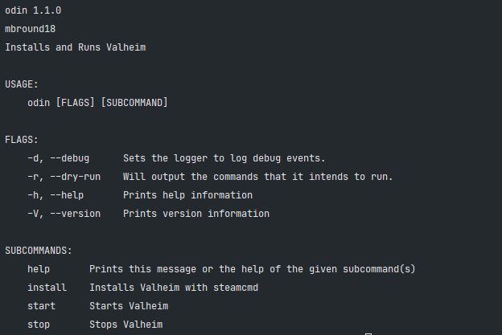
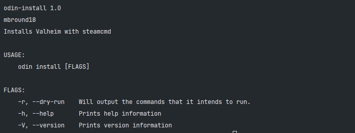
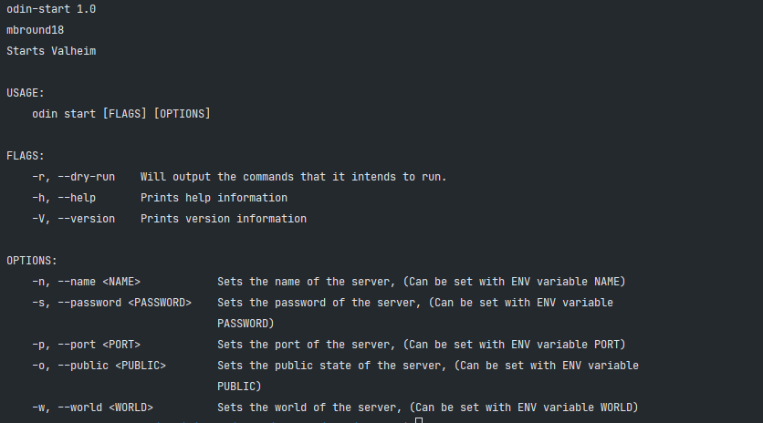
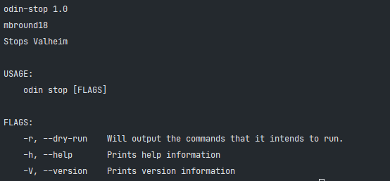

# Odin

Odin is a CLI tool for installing, starting, and stopping [Valheim] servers.

> [Who is Odin?](https://en.wikipedia.org/wiki/Odin)

## Odin Specific Environment Variables

> These are set automatically by Odin.
> You usually do not need to set them unless you are intentionally overriding advanced behavior.

| Variable                        | Default                                 | Required | Description                                                                                                                |
| ------------------------------- | --------------------------------------- | -------- | -------------------------------------------------------------------------------------------------------------------------- |
| DEBUG_MODE                      | `0`                                     | FALSE    | Set to `1` if you want a noisy output and to see what Odin is doing.                                                       |
| DRY_RUN                         | `0`                                     | FALSE    | Set to `1` to print command intent without executing mutating operations.                                                  |
| I_ACCEPT_TO_RUN_THINGS_UNSAFELY | `0`                                     | FALSE    | Root-execution acknowledgement flag for restricted/safety-sensitive paths.                                                 |
| ODIN_CONFIG_FILE                | `config.json`                           | FALSE    | This file stores start parameters to restart the instance, change if you run multiple container instances on the same host |
| ODIN_WORKING_DIR                | `$PWD`                                  | FALSE    | Sets the directory you wish to run `odin` commands in and can be used to set where valheim is managed from.                |
| SERVER_EXECUTABLE_PATH          | `./valheim_server.x86_64`               | FALSE    | Override executable path used by generated config/start flow.                                                              |
| SERVER_EXTRA_LAUNCH_ARGS        | ``                                      | FALSE    | Extra launch args appended to generated Valheim server start command.                                                      |
| ADDITIONAL_SERVER_ARGS          | ``                                      | FALSE    | Legacy/compat extra launch args appended after `SERVER_EXTRA_LAUNCH_ARGS`.                                                 |
| SAVE_INTERVAL                   | `<unset>`                               | FALSE    | Optional save interval (seconds) passed via configure flow.                                                                |
| TITLE                           | `Broadcast`                             | FALSE    | Default title used by `odin notify` when no explicit title argument is provided.                                           |
| MESSAGE                         | `Test Notification`                     | FALSE    | Default message used by `odin notify` when no explicit message argument is provided.                                       |
| USE_PUBLIC_BETA                 | `0`                                     | FALSE    | Enables beta branch behavior when combined with `BETA_BRANCH`/`BETA_BRANCH_PASSWORD`.                                      |
| VALIDATE_ON_INSTALL             | `1`                                     | FALSE    | Set to `0` to skip SteamCMD validation on install/update.                                                                  |
| CLEAN_INSTALL                   | `0`                                     | FALSE    | Set to `1` to clean install directories before installing (with staged-update behavior exceptions).                        |
| CLEAR_STEAM_CACHE_ON_INSTALL    | `1`                                     | FALSE    | Set to `0` to disable pre-install Steam cache cleanup.                                                                     |
| SHOW_FALLBACK_HANDLER           | `0`                                     | FALSE    | Set to `1` to include fallback-handler noise in `odin logs` output.                                                        |
| SHOW_SHADER_WARNINGS            | `0`                                     | FALSE    | Set to `1` to include shader warnings in `odin logs` output.                                                               |
| STEAMCMD_RETRY_ATTEMPTS         | `3`                                     | FALSE    | Number of retry attempts for SteamCMD commands (`install`, app info queries).                                              |
| STEAMCMD_RETRY_BASE_DELAY_SECS  | `5`                                     | FALSE    | Base delay in seconds used for exponential backoff between SteamCMD retries.                                               |
| STAGED_UPDATES                  | `0`                                     | FALSE    | Set to `1` to install into a staging directory first and only promote to live after validation succeeds.                   |
| STAGED_INSTALL_DIR              | `/home/steam/.staging/valheim-pending`  | FALSE    | Override the staging installation directory when `STAGED_UPDATES=1`.                                                       |
| ODIN_SCHEDULER_STATE_FILE       | `${GAME_LOCATION}/logs/jobs_state.json` | FALSE    | Override where Odin persists scheduler runtime state.                                                                      |
| CONCURRENT_DOWNLOADS_ENABLED    | `true`                                  | FALSE    | Set to `false` to download mods one at a time and skip chunked range downloads (avoids Thunderstore 429 rate limiting).     |
| MAX_CONCURRENT_DOWNLOADS        | `4`                                     | FALSE    | Total requests in flight, shared across mod downloads and the range chunks each splits into.                               |
| DOWNLOAD_RETRY_ATTEMPTS         | `5`                                     | FALSE    | Attempts per mod request; 429/5xx responses honor `Retry-After` and otherwise back off exponentially (capped at 60s).       |
| DOWNLOAD_STAGGER_MS             | `250`                                   | FALSE    | Milliseconds between concurrent download starts so requests are spaced out. Set to `0` to disable.                          |
| DOWNLOAD_POOL_MAX_IDLE_PER_HOST | `8`                                     | FALSE    | Idle keep-alive connections retained per host by the shared HTTP pool.                                                     |
| DOWNLOAD_POOL_IDLE_TIMEOUT_SECS | `90`                                    | FALSE    | How long an idle pooled connection is kept before being dropped.                                                           |
| DOWNLOAD_REQUEST_TIMEOUT_SECS   | `300`                                   | FALSE    | Whole-request timeout for mod downloads.                                                                                   |
| DOWNLOAD_CONNECT_TIMEOUT_SECS   | `15`                                    | FALSE    | TCP/TLS connect timeout.                                                                                                   |
| MODS_CONTINUE_ON_FAILURE        | `false`                                 | FALSE    | Set to `true` to install the mods that succeeded and warn about the rest instead of failing the whole run.                  |
| THUNDERSTORE_TOKEN              | `<unset>`                               | FALSE    | Service account token (`tss_...`), sent as `Authorization: Bearer`. Optional: the endpoints Odin reads are public. |
| THUNDERSTORE_BASE_URL           | `https://thunderstore.io`               | FALSE    | Base URL for Thunderstore API lookups and download URLs; override for mirrors or to mock in tests.                          |

## Mod Download Pool

All Thunderstore traffic - version lookups, the HEAD preflight, mod downloads and range
chunks - goes through one shared pool (`utils/http_pool.rs`), which owns three things
that only work as a set:

- **One connection pool**, so repeat requests reuse established TLS connections instead
  of renegotiating per mod and per chunk.
- **One concurrency budget** spanning every layer. Bounding mod downloads and range
  chunks separately is not enough: 4 mods each splitting into 4 chunks is 16 simultaneous
  requests. `MAX_CONCURRENT_DOWNLOADS` caps the real total however the work nests.
- **One rate-limit gate**, so a 429 pauses every worker against the host rather than each
  one rediscovering the limit independently.

Retries honor `Retry-After` verbatim when the server sends it, and otherwise back off
exponentially with jitter so workers throttled together do not all retry on the same
instant. After an install the pool logs a summary of requests, retries, rate limits and
failures.

### Testing

Set `THUNDERSTORE_BASE_URL` to a local mock server to exercise the lookup and download
paths without touching the network - this is how the wildcard resolution tests run.

Two opt-in live tests hit the real services and are `#[ignore]`d by default:

```sh
THUNDERSTORE_LIVE_TEST=1 cargo test -p odin thunderstore_live_resolve -- --ignored
THUNDERSTORE_TOKEN=tss_... cargo test -p odin thunderstore_live_auth -- --ignored
THUNDERSTORE_LIVE_TEST=1 cargo test -p odin thunderstore_live_basic_auth_ignored -- --ignored
VALHEIMPLUS_LIVE_TEST=1 cargo test -p odin download_dll_live -- --ignored
```

### A note on Thunderstore authentication

Verified against the live API: `Authorization: Bearer <tss_ token>` is honoured - a bad
token gets a 401 from `/api/experimental/current-user/`, which is what proves the scheme
is correct. HTTP Basic auth is *ignored* rather than rejected, answering 200 as an
anonymous user, so `THUNDERSTORE_USERNAME`/`THUNDERSTORE_PASSWORD` never actually
authenticated anything and are kept only for backwards compatibility.

The endpoints Odin reads - package listing, version resolution and downloads - are public
and return 200 with no credentials at all, so a token is optional and does not raise any
rate limit. Use the download pool settings above for throttling, not authentication.

## Gotchas

- Odin relies on Rust. [Please install Rust](https://www.rust-lang.org/tools/install)
- Odin also assumes that you have SteamCMD already installed. [Install instructions for SteamCMD.](https://developer.valvesoftware.com/wiki/SteamCMD)
- If you have the proper build tools installed you should be able to run Odin on any system.
- Current Supported Architecture: Unix & Linux based systems.

## Setup

> Make sure you have build essentials installed before you install this crate

1. Install Rust & git
2. Clone the repo
3. `cargo install cargo-make`
4. `makers -e production release`
5. `chmod +x ./target/debug/odin`
6. Copy `./target/debug/odin` to `/usr/local/bin`

## Usage



### Install Valheim

```sh
odin install
```



### Start Valheim

```sh
odin start
```



### Stop Valheim

```sh
odin stop
```



### Status

#### Local Server

```sh
odin status
```

#### Remote Server

Replace the `xx.xx.xx.xx` with your server IP and `query-port` with the `PORT` variable +1 (ex: if `2456` use `2457` which is the steam query port.)

```shell
odin status --address "xx.xx.xx.xx:query-port"
```

### Jobs (Built-in Scheduler)

Run one scheduler tick:

```sh
odin jobs --once
```

Run scheduler continuously:

```sh
odin jobs
```

This scheduler handles `AUTO_UPDATE`, `AUTO_BACKUP`, and `SCHEDULED_RESTART` schedules and replaces container cron usage.

## Systemd service

1. With the root user or using sudo run

   ```shell
   nano /etc/systemd/system/valheim.service
   ```

2. Copy and paste the text below

   ```toml
   [Unit]
   Description=Valheim Server
   After=network.target
   StartLimitIntervalSec=0

   [Service]
   Type=simple
   Restart=always
   RestartSec=1
   User=steam
   Environment="PORT=2456" 'NAME="Valheim Docker"' "WORLD=Dedicated" "PUBLIC=1" "PASSWORD=changeme"
   WorkingDirectory=/home/steam/valheim
   ExecStartPre=/usr/bin/env /usr/local/bin/odin configure
   ExecStart=/usr/bin/env /usr/local/bin/odin start
   ExecStop=/usr/bin/env /usr/local/bin/odin stop

   [Install]
   WantedBy=multi-user.target
   ```

3. Make any necessary changes to the service to fit your needs.
4. Next save the file and start the service.

   ```shell
   sudo systemctl start valheim
   ```

5. To have the server start on server launch, run:

   ```shell
   sudo systemctl enable valheim
   ```
